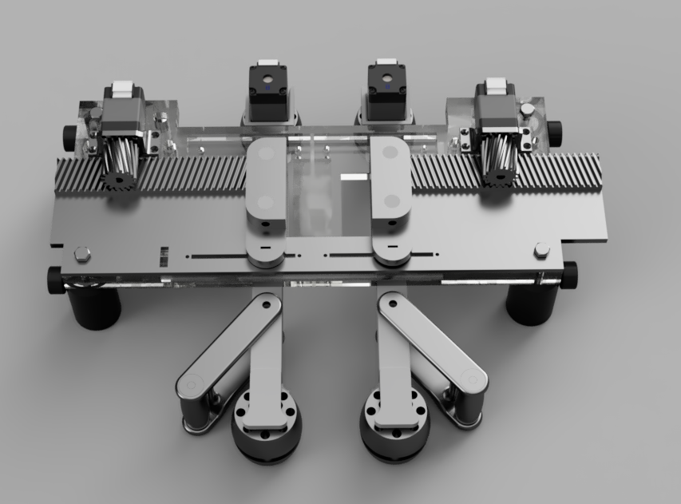

## Treadwall-Main

  
  

### File List
| Treadwall Component | Production Amount | Material |
| :---: | :---: | :---: |
| Leadplate top | 1 piece | Acrylic glass 6mm |
| Leadplate bottom | 1 piece | Acrylic glass 6mm |
| Walls | 2 pieces |  |
| Wall-band | 2 pieces | Silicone |
| Tensioner add-on | 2 pieces |  |
| Tensioner roller | 2 pieces |  |
| Motorized roller | 2 pieces |  |
| Passive roller | 2 pieces |  |
| Rack left | 1 piece |  |
| Rack right | 1 piece |  |
| Pinion gears | 2 pieces |  |
| Motor holder | 2 pieces |  |

All files are available as .stl for 3D-printing. Cutlines for lasercutting are available as .svg

### Commercial Parts List
| Item | Quantity | Notes | Product Example Link |
| :---: | :---: | :---: | :---: |
| Stepper motor | 4 pieces |  | [pololu.com](https://www.pololu.com/product/1204) |
| Sensor plug-in connector | 4 pieces | 4 poles, M8, optional, for open motor cable ends | [conrad.de](https://www.conrad.de/de/p/phoenix-contact-1441037-sensor-aktor-steckverbinder-unkonfektioniert-m8-stecker-gerade-polzahl-4-1-st-589885.html?refresh=true) |
| Extension cable | 4 pieces | 4 poles, M8, optional | [conrad.de](https://www.conrad.de/de/p/bkl-electronic-2700038-sensor-aktor-verlaengerungsleitung-m8-stecker-gerade-auf-kupplung-gerade-2-m-polzahl-4-1-st-2807268.html) |
| Rotary encoder | 1 piece |  |  |
| Limit switch | 4 pieces |  | [rs-online.com](https://de.rs-online.com/web/p/mikroschalter/6821500) |
| Optical sensor | 2 pieces | to sense distance to midline of each wall | [conrad.de ](https://www.conrad.de/de/p/omron-reflexions-lichtschranke-b5w-lb2101-1-b5w-lb2101-1-1-st-2590858.html) |
| Sensor cable | 2 pieces | for optical sensor|[ rs-online.com](https://www.digikey.de/de/products/detail/jst-sales-america-inc/A04ZR04ZR28H305A/6009406) |
| Bearings | 10 pieces | 4 mm inner diameter, 12 mm outer diameter | [kugellager-express.de](https://www.kugellager-express.de/miniatur-kugellager-604-zz-4x12x4-mm) |
| Post Holder | 4 pieces | Partnumber: UPH30/M | [thorlabs.com](https://www.thorlabs.com/newgrouppage9.cfm?objectgroup_id=1982) |
| Post | 4 pieces | Partnumber: TR30/M | [thorlabs.com](https://www.thorlabs.com/newgrouppage9.cfm?objectgroup_id=1266) |
| Dovel | 2 pieces | 32x4mm |  |
| Dovel | 2 pieces | 20x4mm |  |
| Dovel | 2 pieces | ??x4mm |  |
| Screw | 2 pieces | M4 40mm |  |
| Screw | 8 pieces | M4 20mm |  |
| Screw | 8 pieces | M2 20mm |  |
| Nut | 10 pieces | M4 |  |
| Nut | 8 pieces | M2 |  |
