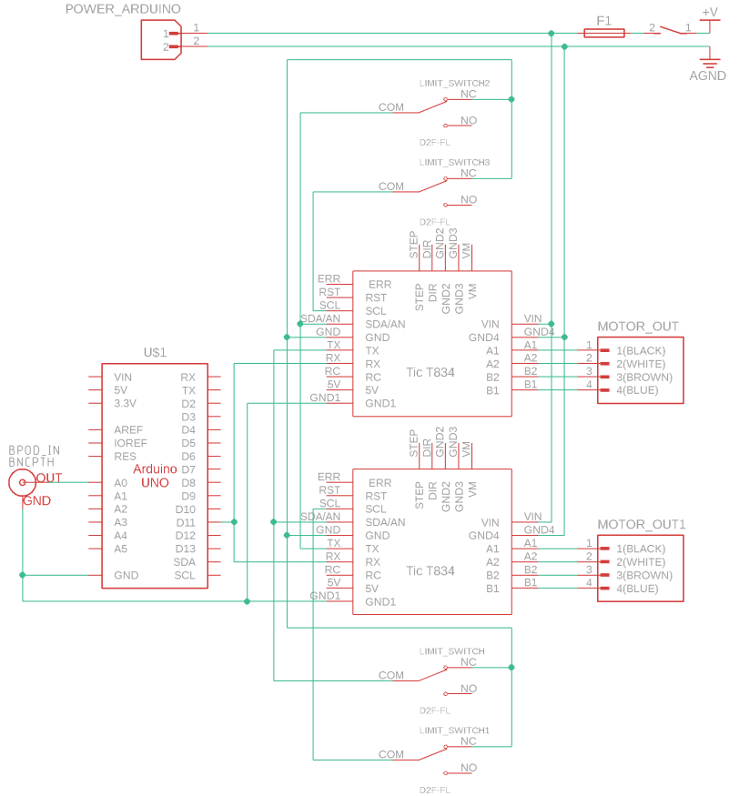

# Wall Mover

  

| Item | Quantity | Notes | Product Example Link |
| :---: | :---: | :---: | :---: |
| Arduino Uno | 1 piece |  | [arduino.cc](https://store-usa.arduino.cc/products/arduino-uno-rev3) |
| Motor controller | 2 pieces |  | [pololu.com](https://www.pololu.com/product/3132) |
| Sensor connector | 2 pieces | M8, 4-poles, stepper motor input | [conrad.de](https://www.conrad.de/de/p/conec-42-01001-sensor-aktor-einbausteckverbinder-m8-buchse-einbau-polzahl-4-1-st-714987.html) |
| Klemmenblock | 2 pieces | 6-pole connector, limit switch input, have to be modified to screw into box |  [digikey.de](https://www.digikey.de/de/products/detail/phoenix-contact/1843266/2528339?srsltid=AfmBOop5y6t12g-orTOnIl3NhloqSnTWAdIEdgyE4AmNeAcU73cpTlei) |
| Klemmenblock-Steckverbinder | 2 pieces | attachted to limit switch cabled | [rs-online.com](https://de.rs-online.com/web/p/leiterplattensteckverbinder/8745127?srsltid=AfmBOopVykBSq5oQ91gx3T2SHp7Yc-NluNhb3vTnxBW_oYocKjTRreX1) |
| BNC Connector | 1 piece | with mounting hardware, bpod system input | [digikey.com](https://www.digikey.de/de/products/detail/amphenol-rf/31-221-RFX/100648) |
| Coding connector | 1 piece | to connect Arduino to computer for easy coding access |  |
| Power connector | 1 piece | power input |  |
| Fuse | 1 piece |  |  |
| Switch | 1 piece |  |  |
| USB-A to USB-B cable | 1 piece | coding cable, inside box |  |
| Wago connector block | 2 pieces | 5 poles, for power and ground distribution inside box | [reichelt.de](https://www.reichelt.de/verbindungsklemme-5-leiteranschluss-wago-221-415-p149800.html?PROVID=2788&gad_source=1&gclid=Cj0KCQjw-5y1BhC-ARIsAAM_oKnrkiWmjAkN6Ogq3tOb9gql4Mfviurv7-E2F_vv9MaZdrLDa4vFq5caAlLFEALw_wcB) |
| Niedervolt-Steckvebrinder | 1 piece | power and ground connection for Arduino | [conrad.de](https://www.conrad.de/de/p/tru-components-dc14-m-niedervolt-steckverbinder-stecker-gerade-5-5-mm-2-1-mm-1-st-1570700.html) |
| Power supply cable | 1 piece | Output: 12V--3A | [conrad.de](https://www.conrad.de/de/p/mean-well-gst36e12-p1j-steckernetzteil-festspannung-12-v-dc-3000-ma-36-w-1439200.html?gclsrc=aw.ds&&utm_source=google&gad_source=1&gclid=CjwKCAiAp4O8BhAkEiwAqv2UqPDl2TvToVBnAKScOY_utBJdjtSIJqPyYSvkBCQbUN3JBkOH7Qh96hoC0G0QAvD_BwE) |
| Extension cable | 1 piece | M8, 6-poles, optional, to connect to Bpod-Module |  |
| Nut M8x0.5 | 2 pieces | to attach 4-pole sensor connectors |  |
| Nut M2 | 4 pieces| to secure 6-pole Klemmenblock |  |
| Screw M2 | 4 pieces | to secure 6-pole Klemmenblock |  |
| Leiterplatte |  | 2.54mm Raster, needed if soldering PCB yourself | [conrad.de](https://www.conrad.de/de/p/tru-components-su527629-europlatine-hartpapier-l-x-b-90-mm-x-50-mm-35-m-rastermass-2-54-mm-inhalt-1-st-1570117.html) |
| Stiftleiste |  | to solder on Cables | [conrad.de](https://www.conrad.de/de/p/tru-components-stiftleiste-standard-anzahl-reihen-1-polzahl-je-reihe-36-1581019-1-st-1581019.html?awaid=11354&referrer=awin&gclid=CjwKCAiAp4O8BhAkEiwAqv2UqGAKbz2nYjUaC9iiHpfdMra5NqZEagBBe5bU08z4UvzodAJE0Htk_xoC-UoQAvD_BwE&utm_source=awin&utm_medium=deeplink&utm_campaign=affiliate&utm_content=article&sv1=affiliate&sv_campaign_id=323889&gad_source=1) |
| Buchsenleiste |  | to solder on PCB | [conrad.de](https://www.conrad.de/de/p/tru-components-buchsenleiste-standard-anzahl-reihen-1-polzahl-je-reihe-36-1580960-1-st-1580960.html) |
| Cables |  | needed if soldering PCB yourself |  |
| Shrinktube |  | needed if soldering PCB yourself | [conrad.de](https://www.conrad.de/de/p/dsg-canusa-8640015953-schrumpfschlauch-ohne-kleber-schwarz-1-60-mm-0-80-mm-schrumpfrate-3-1-10-m-708870.html) |

Alternatively to soldering the PCB yourself, a custom PCB design will be provided soon that can be ordered via comemrcial suppliers.

### Wiring Diagram

  

