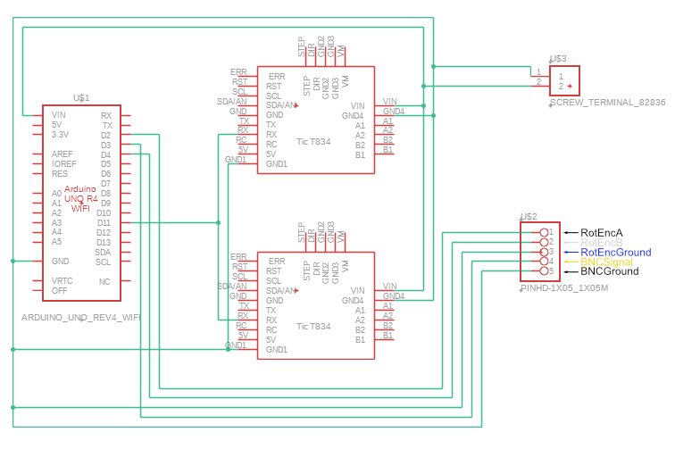

# Wall Synchronizer

  

| Item | Quantity | Notes | Product Example Link |
| :---: | :---: | :---: | :---: |
| Arduino Uno | 1 piece |  | [arduino.cc](https://store-usa.arduino.cc/products/uno-r4-minima) |
| Motor Controller | 2 pieces |  | [pololu.com](https://www.pololu.com/product/3132) |
| Sensor Connector | 2 pieces | M8, 4-poles, stepper motor input | [conrad.de](https://www.conrad.de/de/p/conec-42-01001-sensor-aktor-einbausteckverbinder-m8-buchse-einbau-polzahl-4-1-st-714987.html) |
| Klemmenblock | 1 piece | 3-poles, rotary encoder input |  |
| Klemmenblock-Steckverbinder | 1 piece | 3-poles, fixed to rotary encoder cables |  |
| BNC connector | 1 piece | for speed readout, pwm signal | [rs-online.com](https://de.rs-online.com/web/p/koaxial-steckverbinder/2478704?cm_mmc=DE-PPC-DS3A-_-google-_-3_DE_DE_Steckverbinder_Koaxial+Steckverbinder-_-Amphenol+RF+-+2478704+-+031-221-RFX-_-031+221+rfx&matchtype=e&kwd-357624568267&gclsrc=aw.ds&gad_source=1&gclid=Cj0KCQiAu8W6BhC-ARIsACEQoDAiIw16Yabm6pf_NpcWQlbYtgFehL9bW-eLsVlWCWL0i6I87QHV8fgaAsBjEALw_wcB) |
| Coding connector | 1 piece |  | [conrad.de](https://www.conrad.de/de/p/reversible-usb-durchfuehrung-2-0-buchse-einbau-nausb-w-durchfuehrung-nausb-w-neutrik-inhalt-1-st-746647.html?hk=SEM&WT.mc_id=google_pla&hk=SEM&utm_source=google&utm_medium=cpc&utm_campaign=DE+-+PMAX+-+NonBrand+-+HighSeller&utm_id=21937516534&gad_source=1&gclid=CjwKCAiAp4O8BhAkEiwAqv2UqDQgLmeUS3hh8U5s34KZcGTw5ODwarpQJMzYlEQiw3zXznFJZNDgRBoCC7sQAvD_BwE) |
| Power connector | 1 piece |  | [reichelt.de](https://www.reichelt.de/de/de/shop/produkt/einbaubuchse_zentraleinbau_aussen_5_6_mm_innen_2_5_mm-8525?PROVID=2788&gad_source=1&gclid=CjwKCAiAp4O8BhAkEiwAqv2UqJ-LGX9X_UE05I17LoPmaN20PNHiKWpJkI8QFAmKKp6TWOiNfkGpFxoCdykQAvD_BwE&q=%2Feinbaubuchse-zentraleinbau-aussen-5-6-mm-innen-2-5-mm-hebl-25-p8525.html) |
| Fuse | 1 piece |  | [conrad.de](https://www.conrad.de/de/p/tru-components-tc-r3-12-sicherungshalter-passend-fuer-sicherungen-feinsicherung-5-x-20-mm-10-a-250-v-ac-1-st-1587496.html), [conrad.de](https://www.conrad.de/de/p/eska-522-716-522716-feinsicherung-o-x-l-5-mm-x-20-mm-0-8-a-250-v-traege-t-inhalt-10-st-524346.html) |
| Switch | 1 piece |  | [ conrad.de](https://www.conrad.de/de/p/a12131121000-wippschalter-a12131121000-250-v-ac-10-a-1-x-aus-ein-rastend-1-st-701661.html?hk=SEM&WT.mc_id=google_pla&utm_source=google&utm_medium=cpc&utm_campaign=DE+-+PMAX+-+Nonbrand+-+Electromechanics&utm_id=17946827219&gad_source=1&gclid=CjwKCAiAp4O8BhAkEiwAqv2UqPZ-Tyy6TpWffhCo16eLEivW-vAefXcnrsunWSz7r6p-KnMbkBZluxoC_Q4QAvD_BwE) |
| USB-A to USB-C cable | 1 piece | coding cable, inside box | [conrad.de](https://www.conrad.de/de/p/goobay-38675-usb-c-auf-usb-a-2-0-ladekabel-high-speed-15w-3a-5v-handy-kabel-480-mbits-adapterkabel-schwarz-0-1-m-811278356.html) |
| Power supply cable | 1 piece | Output: 12V--3A | [conrad.de](https://www.conrad.de/de/p/mean-well-gst36e12-p1j-steckernetzteil-festspannung-12-v-dc-3000-ma-36-w-1439200.html?gclsrc=aw.ds&&utm_source=google&gad_source=1&gclid=CjwKCAiAp4O8BhAkEiwAqv2UqPDl2TvToVBnAKScOY_utBJdjtSIJqPyYSvkBCQbUN3JBkOH7Qh96hoC0G0QAvD_BwE) |
| Nut | 2 pieces | M8x0.5, to secure sensor connectors |  |
| Nut | 2 pieces| to secure 3-pole Klemmenblock |  |
| Screw | 2 pieces | to secure 3-pole Klemmenblock |  |
| Leiterplatte |  | needed if soldering PCB yourself | [conrad.de](https://www.conrad.de/de/p/tru-components-su527629-europlatine-hartpapier-l-x-b-90-mm-x-50-mm-35-m-rastermass-2-54-mm-inhalt-1-st-1570117.html) |
| Stiftleiste | 5 poles | to solder on Cables | [conrad.de](https://www.conrad.de/de/p/tru-components-stiftleiste-standard-anzahl-reihen-1-polzahl-je-reihe-36-1581019-1-st-1581019.html?awaid=11354&referrer=awin&gclid=CjwKCAiAp4O8BhAkEiwAqv2UqGAKbz2nYjUaC9iiHpfdMra5NqZEagBBe5bU08z4UvzodAJE0Htk_xoC-UoQAvD_BwE&utm_source=awin&utm_medium=deeplink&utm_campaign=affiliate&utm_content=article&sv1=affiliate&sv_campaign_id=323889&gad_source=1) |
| Buchsenleiste | 5 poles | to solder on PCB | [conrad.de](https://www.conrad.de/de/p/tru-components-buchsenleiste-standard-anzahl-reihen-1-polzahl-je-reihe-36-1580960-1-st-1580960.html) |
| Terminal Block | 1 piece | to solder on PCB, power supply |  |
| Wire set |  |  | [conrad.de](https://www.conrad.de/de/p/quadrios-22cw002-litzensortiment-1-x-0-25-mm-weiss-blau-braun-orange-gruen-gelb-grau-violett-schwarz-rot-1-set-2620404.html) |
| Shrinktube |  |  | [conrad.de](https://www.conrad.de/de/p/dsg-canusa-8640015953-schrumpfschlauch-ohne-kleber-schwarz-1-60-mm-0-80-mm-schrumpfrate-3-1-10-m-708870.html) |

Alternatively to soldering the PCB yourself, a custom PCB design will be provided soon that can be ordered via commercial suppliers.

### Wiring Diagram

  

**Caution:** The Rotary Encoder will get power from the Bpod-Rotary-Encoder-Module. Power has to be provided differently if not using the Bpod-System.
