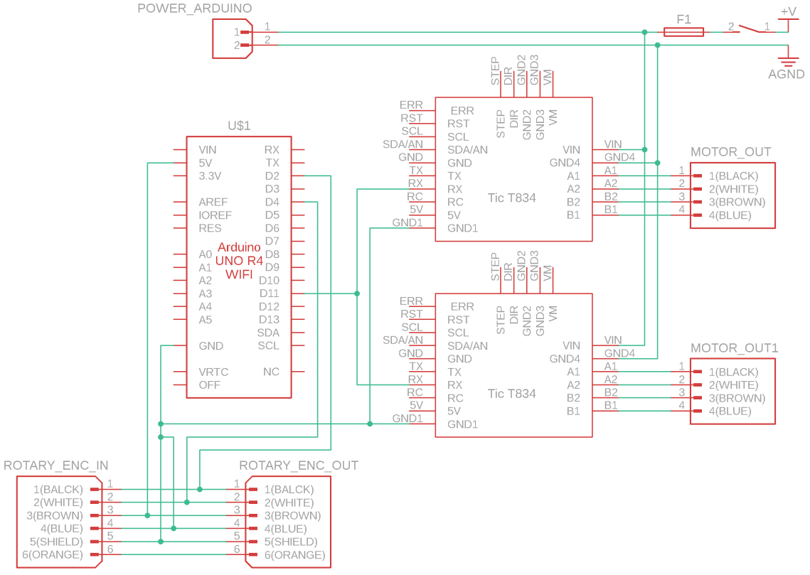

# Wall Synchronizer

  

| Item | Quantity | Notes | Product Example Link |
| :---: | :---: | :---: | :---: |
| Arduino Uno | 1 piece |  | [arduino.cc](https://store-usa.arduino.cc/products/uno-r4-minima) |
| Motor Controller | 2 pieces |  | [pololu.com](https://www.pololu.com/product/3132) |
| Sensor Connector | 2 pieces | M8, 4-poles, stepper motor input | [conrad.de](https://www.conrad.de/de/p/conec-42-01001-sensor-aktor-einbausteckverbinder-m8-buchse-einbau-polzahl-4-1-st-714987.html) |
| Sensor Connector | 1 piece | M8, 6-poles, rotary encoder output, optional | [conrad.de](https://www.conrad.de/de/p/phoenix-contact-1542677-sensor-aktor-einbausteckverbinder-m8-buchse-einbau-0-50-m-polzahl-6-1-st-719684.html) |
| Klemmenblock | 1 piece | 6-poles, 3.5mm raster, rotary encoder input | [digikey.de](https://www.digikey.de/de/products/detail/phoenix-contact/1843266/2528339?srsltid=AfmBOop5y6t12g-orTOnIl3NhloqSnTWAdIEdgyE4AmNeAcU73cpTlei) |
| Klemmenblock-Steckverbinder | 1 piece | 6-poles, 3.5mm raster, fixed to rotary encoder cables | [rs-online.com](https://de.rs-online.com/web/p/leiterplattensteckverbinder/8745127?srsltid=AfmBOopVykBSq5oQ91gx3T2SHp7Yc-NluNhb3vTnxBW_oYocKjTRreX1) |
| BNC connector | 1 piece | for speed readout | [rs-online.com](https://de.rs-online.com/web/p/koaxial-steckverbinder/2478704?cm_mmc=DE-PPC-DS3A-_-google-_-3_DE_DE_Steckverbinder_Koaxial+Steckverbinder-_-Amphenol+RF+-+2478704+-+031-221-RFX-_-031+221+rfx&matchtype=e&kwd-357624568267&gclsrc=aw.ds&gad_source=1&gclid=Cj0KCQiAu8W6BhC-ARIsACEQoDAiIw16Yabm6pf_NpcWQlbYtgFehL9bW-eLsVlWCWL0i6I87QHV8fgaAsBjEALw_wcB) |
| Coding input connector | 1 piece |  |  |
| Power input connector | 1 piece |  |  |
| Fuse | 1 piece |  |  |
| Switch | 1 piece |  |  |
| USB-A to USB-C cable | 1 piece | coding cable, inside box | [conrad.de](https://www.conrad.de/de/p/goobay-38675-usb-c-auf-usb-a-2-0-ladekabel-high-speed-15w-3a-5v-handy-kabel-480-mbits-adapterkabel-schwarz-0-1-m-811278356.html) |
| Wago connector block | 2 pieces | 5 poles, for power and ground distribution inside box | [reichelt.de](https://www.reichelt.de/verbindungsklemme-5-leiteranschluss-wago-221-415-p149800.html?PROVID=2788&gad_source=1&gclid=Cj0KCQjw-)
| Niedervolt-Steckvebrinder | 1 piece | power and ground connection for Arduino | [conrad.de](https://www.conrad.de/de/p/tru-components-dc14-m-niedervolt-steckverbinder-stecker-gerade-5-5-mm-2-1-mm-1-st-1570700.html) |
| Power supply cable | 1 piece | Output: 12V--3A | [conrad.de](https://www.conrad.de/de/p/mean-well-gst36e12-p1j-steckernetzteil-festspannung-12-v-dc-3000-ma-36-w-1439200.html?gclsrc=aw.ds&&utm_source=google&gad_source=1&gclid=CjwKCAiAp4O8BhAkEiwAqv2UqPDl2TvToVBnAKScOY_utBJdjtSIJqPyYSvkBCQbUN3JBkOH7Qh96hoC0G0QAvD_BwE) |
| extension cable | 1 piece | M8, 6-poles, optional, to connect to Bpod-Module |  |
| Cables |  |  |  |
| Shrinktube |  |  |  |
| Leiterplatte |  | needed if soldering PCB yourself |  |
| Terminal Block | 2 pieces | 10 poles, to solder on PCB |  |
| Steckverbinder | | to solder on PCB |  |
| Nut | 3 pieces | M8x0.5, to secure sensor connectors |  |
| Nut | 2 pieces| to secure 6-pole Klemmenblock |  |
| Screw | 2 pieces | to secure 6-pole Klemmenblock |  |

Alternatively to soldering the PCB yourself, a custom PCB design will be provided soon that can be ordered via commercial suppliers.

### Wiring Diagram

  

**Caution:** If using the Bpod-Rotary-Encoder-Module the connection to the Arduino 5V Pin has to be removed. The Rotary Encoder will get power from the Bpod-Module.
