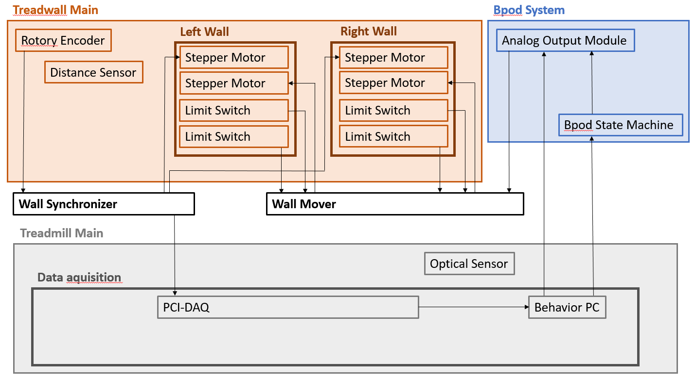

# Treadwall

  

### Components
- [Treadmill-Main](https://github.com/0815Phine/Treadwall/tree/main/Hardware/Treadmill%20Main)
- [Treadwall-Main](https://github.com/0815Phine/Treadwall/tree/main/Hardware/Treadwall%20Main)
- [Wall Synchronizer](https://github.com/0815Phine/Treadwall/tree/main/Hardware/Wall%20Synchronizer)
- [Wall Mover](https://github.com/0815Phine/Treadwall/tree/main/Hardware/Wall%20Mover)

### Wiring Overview

  

## Lasercutting
We used a Trotec Speedy Flex lasercutter with a 100W CO2 laser with the following settings:

| Parameter | Cutting Quality | Engraving Quality |
| :---: | :---: | :---: |
| Power | 70 % | 70 % |
| Speed | 0.2 % | 3.5 % |
| Laser Source | CO2 | CO2 |
| Frequency | 20'000 Hz | 1'000 Hz |
| Passes | 1 | 1 |
| Power Correction | 10 | 10 |
| z-Offset | -2 | 0 |
| Resolution | N.A. | 500 DPI |

## 3D Printing

## Bpod System
Control of the system is done with the Bpod System. We use an 'analog output module' ([sanworks.io](https://sanworks.io/shop/viewproduct?productID=1038)) to adjust the position of the walls. It only runs with a 'state machine' ([sanworks.io](https://sanworks.io/shop/viewproduct?productID=1036)). For further modules see [sanworks.io/products](https://sanworks.io/shop/products.php).
