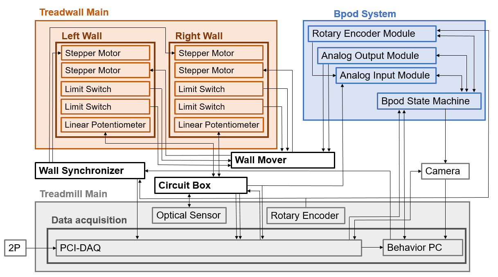

# Treadwall

  

### Hardware Components
- [Treadmill-Main](https://github.com/0815Phine/Treadwall/tree/main/Hardware/Treadmill%20Main)
- [Treadwall-Main](https://github.com/0815Phine/Treadwall/tree/main/Hardware/Treadwall%20Main)
- [Wall Synchronizer](https://github.com/0815Phine/Treadwall/tree/main/Hardware/Wall%20Synchronizer)
- [Wall Mover](https://github.com/0815Phine/Treadwall/tree/main/Hardware/Wall%20Mover)
- [Circuit Box](https://github.com/0815Phine/Treadwall/tree/main/Hardware/Circuit%20Box)

### Wiring Overview

  

## Lasercutting
We used a Trotec Speedy Flex lasercutter with a 100W CO2 laser with the following settings:

| Parameter | Cutting Quality | Engraving Quality |
| :---: | :---: | :---: |
| Power | 70 % | 70 % |
| Speed | 0.2 % | 3.5 % |
| Laser Source | CO2 | CO2 |
| Frequency | 20'000 Hz | 1'000 Hz |
| Passes | 1 | 1 |
| Power Correction | 10 | 10 |
| z-Offset | -2 | 0 |
| Resolution | N.A. | 500 DPI |

Red lines -> cut; black lines -> engrave; blue lines -> not assigned

## 3D Printing

## Bpod System
Control of the system is done with the Bpod System. All used modules are controlled by a 'state machine' ([sanworks.io](https://sanworks.io/shop/viewproduct?productID=1036)).

Modules used for scrambled and predictable experiments:
| Module | Link | Functionality |
| :---: | :---: | :---: |
| Analog Output Module | [sanworks.io](https://sanworks.io/shop/viewproduct?productID=1038) | loaded with Waveplayer Firmware, can play certain analog signals, controls lateral movement of walls |
| Analog Input Module | [sanworks.io](https://sanworks.io/shop/viewproduct?productID=1037) | reads analog signals, used for zone transition in predictable paradigm |
| Rotary Encoder Module V2 | [sanworks.io](https://sanworks.io/shop/viewproduct?productID=1034) | connected directly to the rotary encoder, provides power and sends speed information to analog input module, loaded with modified firmware ([github.com](https://github.com/0815Phine/Bpod_RotaryEncoder_Firmware)) |

For further modules see [sanworks.io/products](https://sanworks.io/shop/products.php).

## Software Dependencies
External code is vendored as **git submodules** under [Code/dependencies/](Code/dependencies/).
Clone with `git clone --recurse-submodules`, or run `git submodule update --init --recursive`
after cloning.

| Submodule | Source | Notes |
| :--- | :--- | :--- |
| `Bpod_Gen2` | [LenaGschossmann/Bpod_Gen2](https://github.com/LenaGschossmann/Bpod_Gen2) @ `softcodes-udp-sync` | Bpod control framework (sanworks fork). The `softcodes-udp-sync` branch is required and is pinned in `.gitmodules`. |
| `Bpod_RotaryEncoder_Firmware` | [0815Phine/Bpod_RotaryEncoder_Firmware](https://github.com/0815Phine/Bpod_RotaryEncoder_Firmware) | Modified rotary-encoder module firmware (needed for the *predictable* experiments). |
| `wavesurfer` | [JaneliaSciComp/Wavesurfer](https://github.com/JaneliaSciComp/Wavesurfer) | WaveSurfer app for synchronized data acquisition. |
| `IEECRSpace` | [IEECR-BeckGroup/IEECRSpace](https://github.com/IEECR-BeckGroup/IEECRSpace) | RSpace integration; `TreadwallGUI.py` adds `IEECRSpace/src` to `sys.path` and imports `rspace`. |

**IEECRSpace must be set up once before the GUI's RSpace features work.** The submodule is a
self-contained app that installs itself on first launch. If you haven't done this yet, run its
first-time setup — on Windows double-click
[`Code/dependencies/IEECRSpace/IEECRSpace_Launcher.bat`](Code/dependencies/IEECRSpace/) (the first
launch downloads its own private Python + dependencies, so it needs an internet connection) — and
then paste your RSpace API key into the app's **Settings** tab. See the
[IEECRSpace README](Code/dependencies/IEECRSpace/README.md) for the full instructions.

**Arduino libraries** are installed via the Arduino IDE **Library Manager** (the IDE resolves
libraries from its own sketchbook `libraries/` folder, not from this repo):
- `CapacitiveSensor` (PaulStoffregen) — Lickport sketches.
- `Tic` (Pololu) — Wall Mover / Wall Synchronizer sketches.
- `Servo`, `SoftwareSerial` — ship with the Arduino IDE.

Python packages and external tools (`ffmpeg`, MATLAB, Pololu Tic driver, Anaconda) will be pinned
in a later step (`environment.yml` + parts list).

## Camera

## Data aquisition

