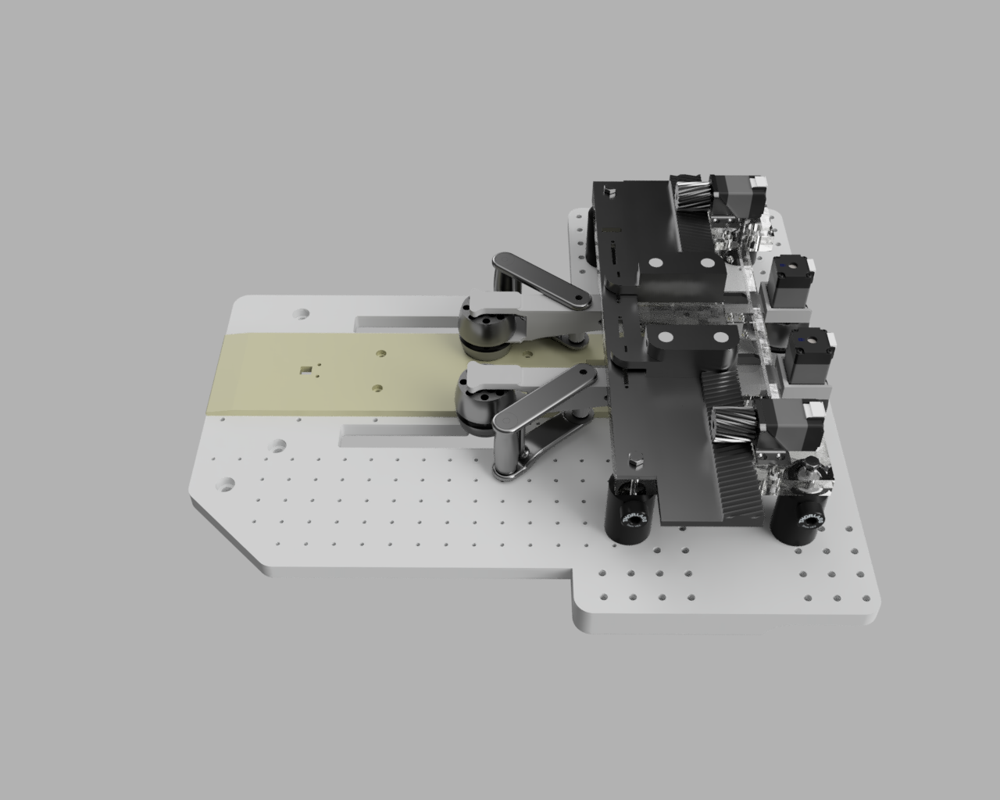
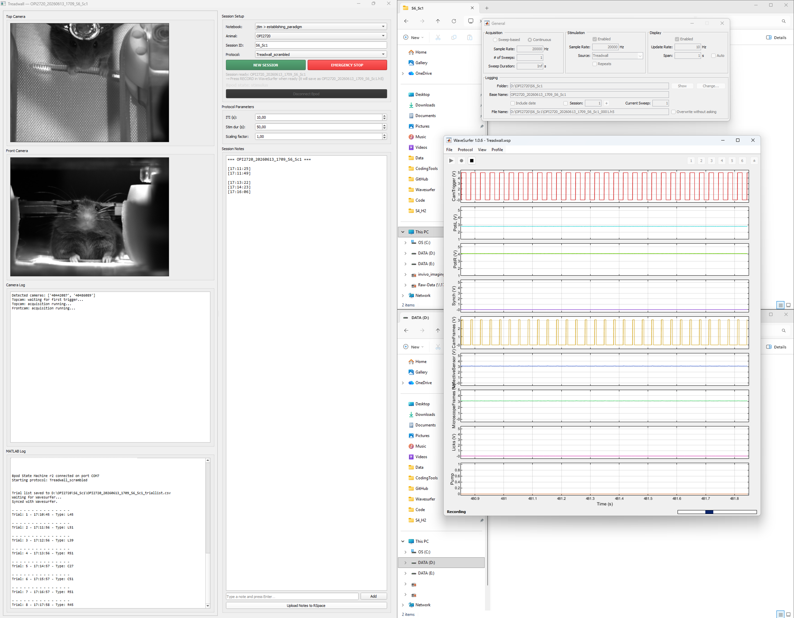

# Treadwall

A Bpod-controlled behavioral rig for head-fixed mice: the animal runs on a
treadmill while two motorized silicone "walls" move laterally to deliver
tactile stimuli that are either synchronized to running speed or driven by an
experimental protocol. A central Python GUI ([`code/treadwallGUI.py`](code/treadwallGUI.py))
launches and coordinates a whole session: dual-camera video, the Bpod state
machine, WaveSurfer data acquisition, and timestamped notes uploaded to RSpace.

<p align="center">
  
</p>

This repository holds everything needed to **rebuild and run** the setup: hardware
files (3D-print STLs, laser-cut SVGs, PCB gerbers, parts lists) under
[`hardware/`](hardware/) and all control software under [`code/`](code/) (see the
[code README](code/README.md)).

### Repository structure

```
Treadwall/
├── hardware/            # build files + parts lists, one folder per component
│   ├── treadmillmain/       running wheel / treadmill
│   ├── treadwallmain/       moving-wall assembly (STLs, SVGs, assembly videos)
│   ├── wallsynchronizer/    Arduino + PCB that syncs wall motion to running speed
│   ├── wallmover/           PCB that drives wall position from Bpod
│   ├── circuitbox/          enclosure electronics
│   ├── assembly.png         setup overview (above)
│   └── connections_overview.png
└── code/                # see code/README.md
    ├── treadwallGUI.py      central session-launcher GUI
    ├── startsession.bat     double-click to launch
    ├── src/                 utility + GUI-helper scripts, camera, Arduino sketches
    ├── protocols/           the five Bpod experiment protocols
    ├── parameters/          central config (treadwall_config.json) + device settings
    └── dependencies/        vendored submodules (Bpod, WaveSurfer, IEECRSpace, …)
```

### Getting started
1. Clone with submodules: `git clone --recurse-submodules https://github.com/0815Phine/Treadwall.git`
   (or `git submodule update --init --recursive` after a plain clone).
2. Create the `treadwall` conda environment (see [Python environment](#python-environment)).
3. Set up the IEECRSpace submodule once (see [Software Dependencies](#software-dependencies)).
4. Install **ffmpeg** and put it on `PATH` (see [Python environment](#python-environment)).
5. Edit the paths in [`code/parameters/treadwall_config.json`](code/parameters/treadwall_config.json)
   for this machine (MATLAB/Python executables, data + IPC directories).
6. Open Matlab and add the paths of wavesurfer and bpod (both found under `code/dependencies`).
7. Launch Bpod by typing bpod in the Matlab console and set it up (see [Bpod setup])
8. Launch a session by double-clicking [`code/startsession.bat`](code/startsession.bat)
   — see [Running a Session](#running-a-session).

## Bpod System
Control of the system is done with the Bpod System. All used modules are controlled by a 'state machine' ([sanworks.io](https://sanworks.io/shop/viewproduct?productID=1036)).

Modules used for scrambled and predictable experiments:
| Module | Link | Functionality |
| :---: | :---: | :---: |
| Analog Output Module | [sanworks.io](https://sanworks.io/shop/viewproduct?productID=1038) | loaded with Waveplayer Firmware, can play certain analog signals, controls lateral movement of walls |
| Analog Input Module | [sanworks.io](https://sanworks.io/shop/viewproduct?productID=1037) | reads analog signals, used for zone transition in predictable paradigm |
| Rotary Encoder Module V2 | [sanworks.io](https://sanworks.io/shop/viewproduct?productID=1034) | connected directly to the rotary encoder, provides power and sends speed information to analog input module, loaded with modified firmware ([github.com](https://github.com/0815Phine/Bpod_RotaryEncoder_Firmware)) |

For further modules see [sanworks.io/products](https://sanworks.io/shop/products.php).

### Bpod setup
On **first start** Bpod has to be configured to run properly. Therefore start the Bpod GUI by typing ```bpod``` in the Matlab console.
All modules have to be coupled with the correct COM of your system (also check the Arduino COM in the main treadwall_config.json).
Also once you have to configure the data paths. Use the same 'Data Root' as defined in the config file (this is not strictly needed but in case of falling back to this, it is good to match).
The 'Protocols' directory should point to ```code/protocols```.

## Software Dependencies
| Tool | Version / build | Purpose |
| :--- | :--- | :--- |
| MATLAB | R2024a | Runs Bpod (`Bpod_Gen2`) + WaveSurfer |
| WaveSurfer | 1.0.x (see `code/dependencies/Wavesurfer`) | Synchronized data acquisition (needs a DAQ) |
| ffmpeg ([ffmpeg.org](https://ffmpeg.org/)) | gyan.dev **full** build, on `PATH` | Live H.264 encoding in `videoacquisition.py`; full build needed for `h264_nvenc` (GPU) |
| Anaconda / Python | Python 3.11 | Runs the GUI + camera scripts (`treadwall` env) |
| Basler pylon Camera Software Suite | matching pypylon 4.1 | Camera drivers/runtime for `pypylon` |
| NI-DAQmx driver + NI DAQ device | — | WaveSurfer acquisition + TTL sync (the "DAQ-Box") |
| Pololu Tic software (Tic Control Center) | — | Configure the Wall Mover / Wall Synchronizer stepper controllers |
| Arduino IDE | 2.x ([arduino.cc](https://www.arduino.cc/en/software)) | Flash/modify the Wall-Synchronizer Arduino + rotary-encoder firmware |
| git | ≥ 2.x | Clone the repo with `--recurse-submodules` |
| PsychToolbox (*optional*) | — | **Not needed for Treadwall's default setup.** Bpod only requires it for legacy MATLAB (r2019a or older), displaying video/sound stimuli on the PC, or the legacy Bonsai UDP/TCP link — none of which Treadwall uses. Safe to keep installed if you already have it. |

### Submodules
External code is vendored as **git submodules** under [code/dependencies/](code/dependencies/).
Clone with `git clone --recurse-submodules`, or run `git submodule update --init --recursive`
after cloning.

| Submodule | Source | Notes |
| :--- | :--- | :--- |
| `Bpod_Gen2` | [sanworks/Bpod_Gen2](https://github.com/sanworks/Bpod_Gen2) @ `master` (pinned `8e5b008`, v1.9.0) | Stock Bpod control framework. |
| `Bpod_RotaryEncoder_Firmware` | [0815Phine/Bpod_RotaryEncoder_Firmware](https://github.com/0815Phine/Bpod_RotaryEncoder_Firmware) | Modified rotary-encoder module firmware (needed for the *predictable* experiments). |
| `Wavesurfer` | [JaneliaSciComp/Wavesurfer](https://github.com/JaneliaSciComp/Wavesurfer) | WaveSurfer app for synchronized data acquisition. |
| `IEECRSpace` | [IEECR-BeckGroup/IEECRSpace](https://github.com/IEECR-BeckGroup/IEECRSpace) | RSpace integration; `treadwallGUI.py` adds `IEECRSpace/src` to `sys.path` and imports `rspace`. |

**IEECRSpace must be set up once before the GUI's RSpace features work.** The submodule is a
self-contained app that installs itself on first launch. If you haven't done this yet, run its
first-time setup — on Windows double-click
[`code/dependencies/IEECRSpace/IEECRSpace_Launcher.bat`](code/dependencies/IEECRSpace/) (the first
launch downloads its own private Python + dependencies, so it needs an internet connection) — and
then paste your RSpace API key into the app's **Settings** tab. See the
[IEECRSpace README](code/dependencies/IEECRSpace/README.md) for the full instructions.

### Python environment
The GUI and camera scripts run on a dedicated conda environment pinned in
[`code/dependencies/environment.yml`](code/dependencies/environment.yml). Create it once:

```
conda env create -f code/dependencies/environment.yml
```

This builds an env named `treadwall` (Python 3.11 + numpy, opencv-python, pypylon, PyQt5,
requests). The launcher ([code/startsession.bat](code/startsession.bat)) and the camera subprocess
already point at this env's interpreter, so **the `treadwall` env must exist for the app to run**.
(`rspace` is not listed here — it is imported from the `IEECRSpace` submodule source.)

**ffmpeg** is required for live video encoding and is **not** a conda package here — the camera
calls `ffmpeg` by name, so it must be on the system `PATH`. FFmpeg's official home is
[ffmpeg.org](https://ffmpeg.org/), which doesn't ship Windows binaries itself but links trusted
builders on its [download page](https://ffmpeg.org/download.html) (→ *Windows*). Install the
**gyan.dev _full_ build**: `winget install Gyan.FFmpeg`, or download `ffmpeg-full` from
[gyan.dev/ffmpeg/builds](https://www.gyan.dev/ffmpeg/builds/), unzip, and add its `bin\` folder to
`PATH`; verify with `ffmpeg -version`. Use the *full* build (not the conda-forge one): the camera
auto-detects and prefers the `h264_nvenc` (NVIDIA GPU) encoder, which the full build ships but the
conda-forge build generally omits — otherwise capture silently falls back to CPU `libx264`.

### Arduino libraries
**Arduino libraries** are installed via the Arduino IDE **Library Manager** (the IDE resolves
libraries from its own sketchbook `libraries/` folder, not from this repo):
- `CapacitiveSensor` (PaulStoffregen) — Lickport sketches.
- `Tic` (Pololu) — Wall Synchronizer sketches.
- `Servo`, `SoftwareSerial` — ship with the Arduino IDE.

## Camera
Two Basler cameras are captured by
[`code/src/videoacquisition.py`](code/src/videoacquisition.py) via `pypylon`:
- a **top** camera (30 fps, hardware-triggered) and
- a **front** camera (200 fps).

Frames are encoded live to visually-lossless H.264 `.mp4` (per camera), preferring
the GPU `h264_nvenc` encoder and falling back to CPU `libx264`. All camera
settings — serials, resolution, exposure, fps, trigger lines, encode quality —
live in the `cameras` block of
[`code/parameters/treadwall_config.json`](code/parameters/treadwall_config.json),
with full Basler feature sets in the `.pfs` files under
[`code/parameters/camera/`](code/parameters/camera/). Each session produces, per
camera, a `.mp4`, a `_timestamps.txt` (+ `_pc_timestamps.txt`) sidecar, and a
`_cam_metadata.json`.

## Data acquisition
Synchronized analog/TTL signals are recorded with **WaveSurfer** over an NI-DAQ
device, using the protocol file
[`code/parameters/wavesurfer/treadwall.wsp`](code/parameters/wavesurfer/treadwall.wsp).
The Bpod state machine writes its own session `.mat`. All outputs for a session
are saved under the configured `data_root` (`paths.data_root` in
`treadwall_config.json`), organized as `<data_root>\<animal>\<session>`.

## Running a Session
Sessions are launched and coordinated from the central GUI
([`code/treadwallGUI.py`](code/treadwallGUI.py)), started by double-clicking
[`code/startsession.bat`](code/startsession.bat). The GUI orchestrates the camera,
the Bpod state machine, and WaveSurfer, and lets you take notes that upload
directly to RSpace — all without restarting MATLAB between sessions.

<p align="center">
  
</p>

Typical flow:
1. Double-click `startsession.bat` — the GUI opens and MATLAB starts in the
   background.
2. Pick the RSpace notebook and animal ID from the dropdowns (fetched live from
   RSpace), and choose a protocol.
3. Press **Start** — the camera preview goes live and the Bpod protocol runs.
4. Take timestamped notes during the session; they upload to RSpace.
5. The GUI auto-detects when the Bpod protocol ends, lets the camera finish
   saving, and prompts for note upload / WaveSurfer stop.

For the internals (IPC files, session helpers, multi-session loop) see the
[code README](code/README.md).
