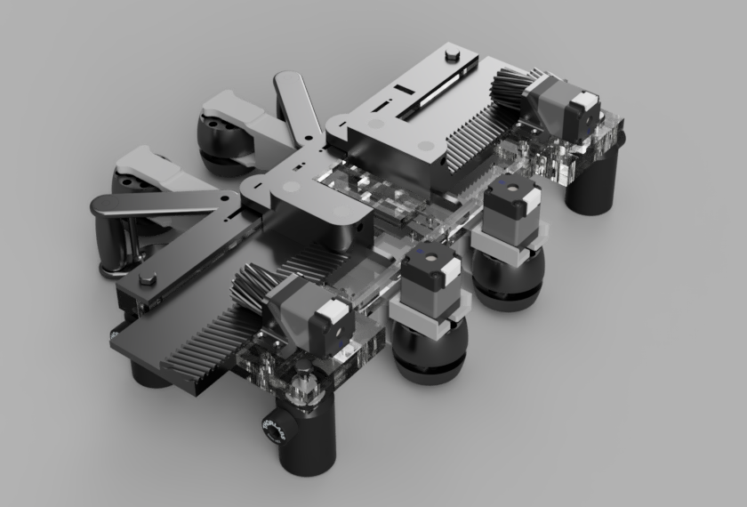
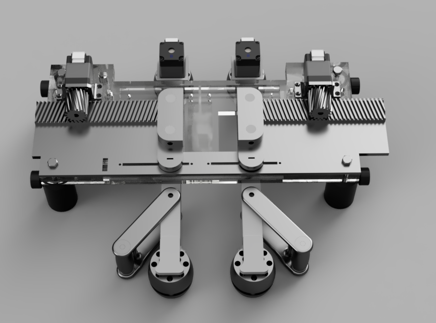

# Treadwall-Main

The moving-wall assembly: two silicone bands ("walls") on either side of the
animal, each driven laterally by a rack-and-pinion stepper stage and kept taut by
a tensioner. The walls provide the tactile stimulus that moves relative to
the animal during an experiment.

  
  

### Assembly

Full-rig assembly
([download](./images/treadwall_assembly.mp4) if the player does not load):

<video src="https://github.com/0815Phine/Treadwall/raw/main/hardware/treadwallmain/images/treadwall_assembly.mp4" controls width="800"></video>

Wall assembly
([download](./images/wall_assembly.mp4)):

<video src="https://github.com/0815Phine/Treadwall/raw/main/hardware/treadwallmain/images/wall_assembly.mp4" controls width="800"></video>

### File List
| Treadwall Component | File | Production Amount | Material | Notes |
| :---: | :---: | :---:  | :---: | :---: |
| Guidingplater topper | [cutlines.svg](guidingplate_topper_cutlines.svg) | 1 piece | Acrylic glass 3mm | cut with lasercutter |
| Guidingplate top | [cutlines.svg](guidingplate_top_cutlines.svg) ([measurments](guidingplate_top_measurments.pdf)) | 1 piece | Acrylic glass 6mm | cut with lasercutter |
| Guidingplate bottom | [cutlines.svg](guidingplate_bottom_cutlines.svg) ([measurements](gguidingplate_bottom_measuremnets.pdf)) | 1 piece | Acrylic glass 6mm | cut with lasercutter |
| Walls | [wall.stl](wall.stl) | 2 pieces |  | without tensioner attachement |
| Wall-band |  | 2 pieces | Silicone | use mould [wallband_mould.stl](wallband_mould.stl) and buck [wallband_buck.stl](wallband_buck.stl) |
| Tensioner holder | [tension_holder.stl](tension_holder.stl) | 2 pieces |  |  |
| Tensioner roller | [tension_roller.stl](tension_roller.stl) | 2 pieces |  |  |
| Motorized roller | [roller_motorized.zip](roller_motorized.zip) | 2 pieces |  | only top and bottom part need to be printed |
| Passive roller | [roller_passive.zip](roller_passive.zip) | 2 pieces |  | only top and bottom part need to be printed |
| Rack left | [rack_left.stl](rack_left.stl) | 1 piece |  |  |
| Rack right | [rack_right.stl](rack_right.stl) | 1 piece |  |  |
| Pinion gear left | [piniongear_left.stl](piniongear_left.stl) | 1 piece |  |  |
| Pinion gear right | [piniongear_right.stl](piniongear_right.stl) | 1 piece |  |  |
| Motor mount | [motormount_v2.stl](motormount_vr.stl) | 2 pieces |  |  |
| Heat sink | [measurments](motormount_v1.pdf) | 2 pieces | metal | old motor mount, fabricated with CNC-machine |

All files are available as .stl for 3D-printing. Cutlines for lasercutting are available as .svg

### Commercial Parts List
| Item | Quantity | Notes | Product Example Link |
| :---: | :---: | :---: | :---: |
| Stepper motor | 2 pieces | for Synchronizer, 3.9V, 0.6A/Phase | [pololu.com](https://www.pololu.com/product/1204) |
| Stepper motor | 2 pieces | for Mover, 4.3V, 0.8A/Phase | [pololu.com](https://www.pololu.com/product/2256) |
| Sensor plug-in connector | 4 pieces | 4 poles, M8, optional, for open motor cable ends | [conrad.de](https://www.conrad.de/de/p/phoenix-contact-1441037-sensor-aktor-steckverbinder-unkonfektioniert-m8-stecker-gerade-polzahl-4-1-st-589885.html?refresh=true) |
| Extension cable | 4 pieces | 4 poles, M8, optional | [conrad.de](https://www.conrad.de/de/p/bkl-electronic-2700038-sensor-aktor-verlaengerungsleitung-m8-stecker-gerade-auf-kupplung-gerade-2-m-polzahl-4-1-st-2807268.html) |
| Limit switch | 4 pieces |  | [rs-online.com](https://de.rs-online.com/web/p/mikroschalter/6821500) |
| Linear Potentiometer | 2 pieces | to read position of each wall | [digikey.de](https://www.digikey.de/de/products/detail/alps-alpine/RS45111A900F/19529172?srsltid=AfmBOoqe_ibpDdC7ibSj-AWdjissQJESolceGMemrtyWqWWEwYaIySdd) |
| Bearings | 10 pieces | 4 mm inner diameter, 12 mm outer diameter | [kugellager-express.de](https://www.kugellager-express.de/miniatur-kugellager-604-zz-4x12x4-mm) |
| Post Holder | 4 pieces | Partnumber: UPH30/M, adaptable | [thorlabs.com](https://www.thorlabs.com/newgrouppage9.cfm?objectgroup_id=1982) |
| Post | 4 pieces | Partnumber: TR30/M, adaptable | [thorlabs.com](https://www.thorlabs.com/newgrouppage9.cfm?objectgroup_id=1266) |
| Dovel | 2 pieces | 32x4mm, for passive roller |  |
| Dovel | 2 pieces | 20x4mm, for motorized roller |  |
| Dovel | 4 pieces | for attaching wall to rack |  |
| Screw | 2 pieces | M4 40mm |  |
| Screw | 8 pieces | M4 20mm |  |
| Screw | 8 pieces | M2 20mm |  |
| Nut | 10 pieces | M4 |  |
| Nut | 8 pieces | M2 |  |
